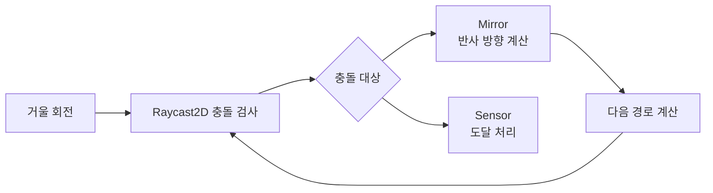

<div align="center">

# Sync Puzzle

서로 다른 정보를 가진 두 플레이어가  
협동하여 퍼즐을 해결하는 2인 온라인 퍼즐 게임


</div>

---

## 프로젝트 소개

Sync Puzzle은 플레이어마다 다른 정보와 시야를 기반으로  
협력하여 퍼즐을 해결하는 멀티플레이 퍼즐 게임입니다.

MasterClient 기반 퍼즐 판정 구조를 사용하여  
멀티플레이 환경에서 퍼즐 상태를 일관되게 유지하도록 구성했습니다.

---

## Links

<p align="center">
<a href="https://www.youtube.com/watch?v=iuVHFhuQx14">
    
  </a>
</p>

---

## 개발 정보

- **엔진** : Unity
- **언어** : C#
- **네트워크** : Photon PUN2
- **인증** : Firebase Authentication
- **플랫폼** : Windows PC
- **개발 인원** : 개인 프로젝트

---

## 멀티플레이 진행 흐름


---

## 공통 퍼즐 RPC 구조

모든 퍼즐은 동일한 RPC 입력 구조를 사용하도록 설계했습니다.

```text
Client Input
   ↓
RequestPress(puzzleId, action, value)
   ↓
MasterClient 판정
   ↓
RPC 결과 동기화
   ↓
전체 클라이언트 상태 반영
```
| Puzzle | puzzleId | action 의미 | value 의미 | 판정 방식 |
|---|---|---|---|---|
| Sync Button | 2 | 버튼 A/B | 입력 발생값 | 시간 차 비교 |
| Password | 3 | 숫자 입력 / Enter | 입력 숫자 | 문자열 비교 |
| Lever | 4 | 레버 index | 상태값 | 조합 판정 |
| Mirror | 5 | 거울 회전 / 센서 | 대상 index | 레이저 반사 계산 |

---

## 주요 기능

### 1. 협동 타이밍 퍼즐

두 플레이어가 일정 시간 안에 동시에 버튼을 눌러야 성공하는 퍼즐입니다.

- PhotonNetwork.Time 기반 시간 비교
- 입력 시간 저장 및 동기화
- 실패 시 퍼즐 상태 초기화


---

### 2. 비밀번호 입력 퍼즐

한 플레이어만 키패드를 조작할 수 있으며  
정답 입력 시 blocker가 해제됩니다.

- 키패드를 연 플레이어를 입력 소유자로 지정
- 소유자만 숫자 입력 가능
- 4자리 입력 후 Enter로 정답 판정
- 실패 시 입력값 초기화


---

### 3. 레버 조합 퍼즐

레버 입력 상태를 배열로 관리하여  
정해진 조합 만족 시 성공하는 퍼즐입니다.

- 각 레버는 한 번 누르면 잠금
- 누른 레버 상태를 배열에 저장
- 필요한 개수만큼 누르면 조합 검사
- 실패 시 레버 상태와 표시 전체 초기화


---

### 4. 레이저 반사 퍼즐

거울을 회전시켜 레이저를 센서까지 유도하는 퍼즐입니다.

- 거울 클릭 시 90도 단위 회전
- `Raycast2D`로 레이저 충돌 지점 확인
- 거울에 닿으면 `Vector2.Reflect`로 반사 방향 계산
- 센서 도달 여부만 퍼즐 결과로 사용


#### 처리 흐름



#### 핵심 코드

```csharp
RaycastHit2D hit = Physics2D.Raycast(startPos, dir, maxDistance, hitMask);

if (hitLayer == LayerMask.NameToLayer("Mirror"))
{
    dir = Vector2.Reflect(dir, hit.normal).normalized;
    startPos = hit.point + hit.normal * hitOffset;
}
else if (hitLayer == LayerMask.NameToLayer("Sensor"))
{
    hit.collider.GetComponent<LaserSensor2D>()?.MarkLitThisFrame();
}
```

---

### 5. 로프 협동 퍼즐

두 플레이어를 로프로 연결하고  
일정 거리 이상 멀어지면 서로를 끌어당기는 퍼즐입니다.

- `LineRenderer`로 두 플레이어 연결 시각화
- 상대 위치를 기준으로 거리 계산
- 최대 거리 초과 시 `Rigidbody2D`에 견인 힘 적용
- `stiffness`, `damping` 값으로 견인감 조절


